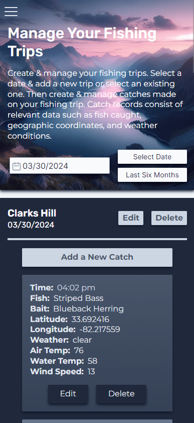
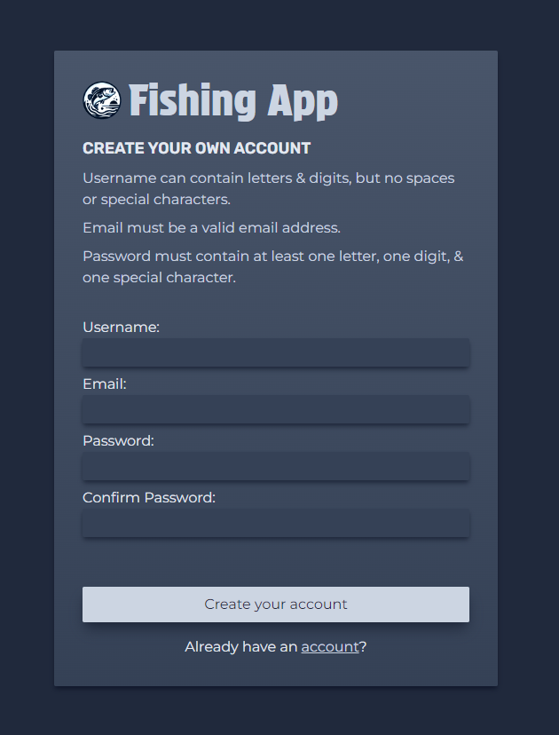
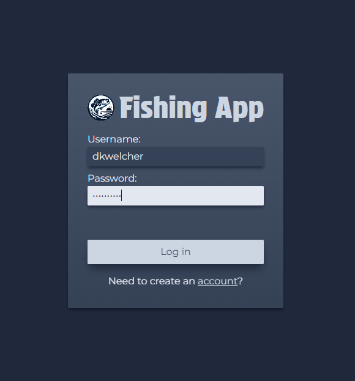

# Fishing App

Fishing App is a web application for maintaining a logbook of fishing catches and planning future fishing trips. The app automatically generates time, geographic coordinates, and weather data when a user adds a new catch. The Fishing Trip Planner feature is currently being worked on. This feature will combine the user's historical data and the forecasted weather of the date of the planned trip to provide recommendations for fishing locations and lure / bait strategies.

## Source Code

Server: https://github.com/dkwelcher/fishingapp-server 
Client: https://github.com/dkwelcher/fishingapp-client

## Screenshots

    
    
    

## Methodology Overview

- Adapted from Agile principles (https://agilemanifesto.org)
- Cycle: design -> prototype -> implement -> refactor -> test -> debug -> evaluate

## Tech Stack

- Client
  - Vite, React, TailwindCSS, JavaScript
- Server
  - Maven, Spring Boot, Java
- Database
  - PostgreSQL
- Containerization
  - Docker
- Tools
  - GitHub
- Testing
  - JUnit5, Cypress (soon)

## Current To-Do List (Week of 10/21/2024)

- Refactor React components (some components need to be broken down into smaller components)
- Assess need for Redux / Context
- Write Cypress tests for client source code
- Write additional JUnit tests for server source code
